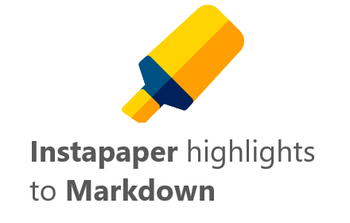

# Instapaper to Markdown Chrome extension

I have developed a simple Chrome extension that allows exporting Instapaper highlights to Markdown in Instapaper's web application.

When reading articles in Instapaper, the extension adds a new link "Export to Markdown" which allows downloading a Markdown file with the highlights in the document as can be seen in the image below.

The extension provides a functionality currently missing in Instapaper web application and corrects the export functionality available in the mobile app (in some cases the order of the highlights does not correspond with order they appear in the document).

The extension only works when visiting an article in https://www.instapaper.com/read/

Please note that if you have just added highlights to the document you need to reload the page before clicking on the link to generate the Markdown otherwise the generated document will not include the new highlights.

NOTE: this extension is not affiliated to Instapaper

> Highlight icon designed by Freepik (www.freepik.com) from Flaticon